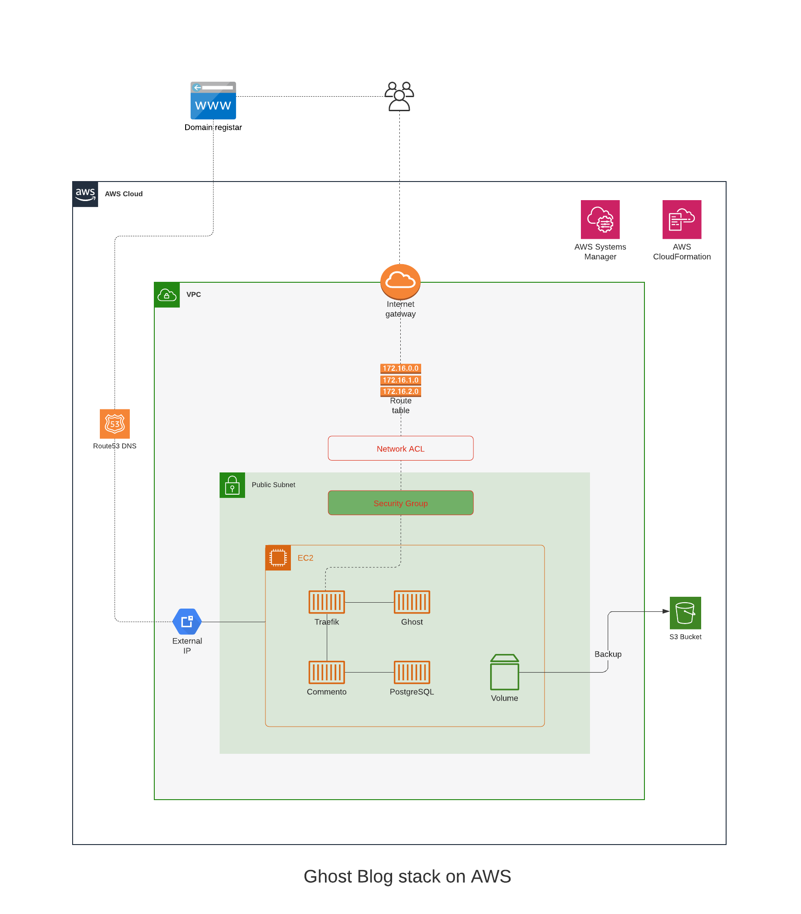

# Deploy your own blog in AWS using Ghost platform

Ghost is a lightweight blogging platform. This repository contains CloudFormation scripts and other resources 
to deploy your own Ghost blog stack in AWS with a very little effort. 

Below is the high level design of the entire stack. It uses Ghost as the blogging platform, Traefik as the reverse proxy
and Commento as the commenting platform that works with a PostgreSQL database. Everything is running on docker inside an
EC2 instance on AWS. Docker-compose is used for the container orchestration.

## Prerequisites
1. Registered domain for the Lets Encrypt integration to work
2. User account and domain verification with an SMTP provider such as mailgun
3. AWS account and an IAM user with programmatic access

## Configuration files to update before deployment
Once you clone the repository make sure to update the following files to reflect your details.

1. commento.env

   Comment out everything but below two values for the initial deployment as smtp setup 
   interferes with the Commento admin account registration
   
   * `COMMENTO_ORIGIN`
   
   * `COMMENTO_POSTGRES`

2. ghost.env
3. docker-compose.yaml
   Update the following lines
    
   * `certificatesresolvers.letsencrypt.acme.email={YOUR EMAIL}`
   * `traefik.http.routers.traefik.rule=Host(dashboard.{YOUR DOMAIN})`
   * `traefik.http.middlewares.dashboardauth.basicauth.users={USER}:{PASSWORD generated using htpasswd}`
   * `traefik.http.routers.ghost.rule=Host({YOUR DOMAIN})`
   * `traefik.http.routers.commento.rule=Host(commento.{YOUR DOMAIN})`

4. ghost-blog-setup.cfn.yaml

   * `command: "sudo aws s3 cp s3://{YOUR BUCKET NAME}/blog/config/ /data/traefik/ --recursive"`

5. inception.cfn.yaml
   
   * search for `jayforewb.com` and replace with your domain.

6. Makefile
   
   * Update the profile value to your AWS CLI profile

****Note: I have to work a bit more to reduce the number of places that we have to 
update before deployment. 

## Initial deployment
1. Deploy the `inception stack` - this creates the initial infrastructure in the AWS account
2. Deploy the `blog-host stack` - this configures and starts your own Ghost blog

## After deployment
1. Register yourself to new commento on https://commento.yourdomain.com
2. Use AWS SSM to log into the EC2, navigate to /data/traefik folder and bring down the stack with `docker-compose down`
3. Uncomment smtp setup values in `commento.env`
4. Start docker compose with `docker-compose up -d`
5. Register your admin user with ghost on https://yourdomain.com/ghost

Have a look at https://fewmorewords.com/ghost-on-aws/. 

It explains everything in detail.

If you have any questions/suggestions, please feel free to drop a line at https://fewmorewords.com

The fully working demo site is available on https://jayforweb.com

Enjoy!
