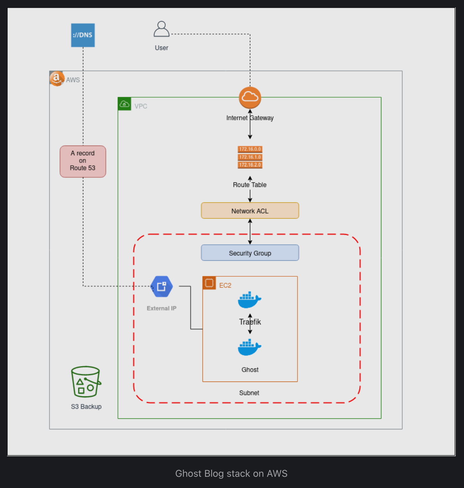

# Deploy your own blog in AWS using Ghost platform

Ghost is a great lightweight alternative for Wordpress. This repository contains CloudFormation scripts and other info to deploy your own Ghost blog stack in AWS. Below is the highlevel design of the entire stack.

## How to deploy
1. Create an AWS account
2. Setup AWS-CLI and create a profile
3. Clone this repository
4. Update PROFILE value in the Makefile
5. Deploy the inception stack - this creates the initial infrastructure in the AWS account
6. Deploy the blog-host stack - this configures and starts your own Ghost blog

Have a look at https://fewmorewords.com/ghost-on-aws/. It explains all the steps in detail.

Enjoy!
